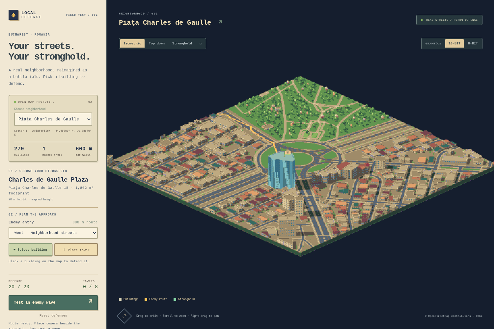
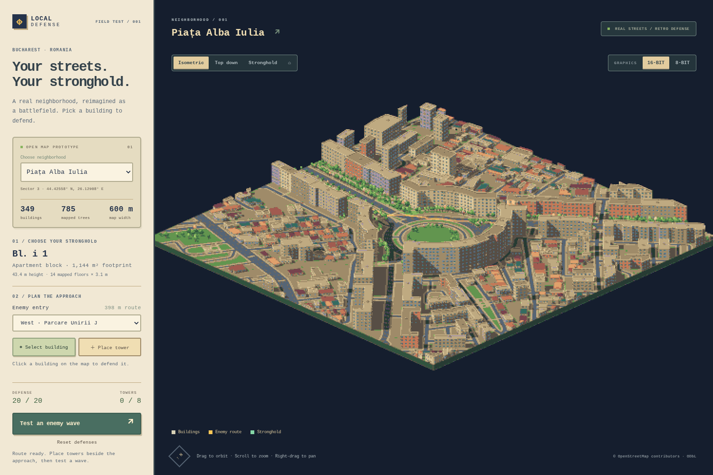
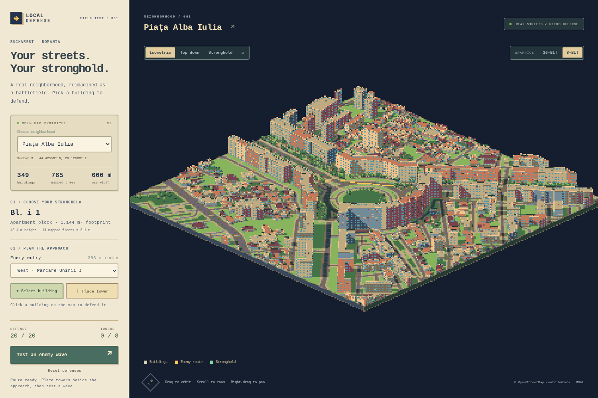

# Local Defense — Bucharest neighborhoods

[Play the live game](https://marginallyharmless.github.io/Maps-TD/) · [Open Charles de Gaulle](https://marginallyharmless.github.io/Maps-TD/?map=charles-de-gaulle)

A playable browser experiment built from real OpenStreetMap geometry in Bucharest. Choose between two 600 × 600 m neighborhoods using the sidebar selector:

- **Piața Alba Iulia** — initial stronghold: Bl. i 1.
- **Piața Charles de Gaulle / Aviatorilor** — initial stronghold: Charles de Gaulle Plaza, Piața Charles de Gaulle 15. Open directly with `?map=charles-de-gaulle`.

Switching neighborhoods starts a fresh game, clearing the previous defenses and wave.

The map uses a pixel-art strategy-game aesthetic. **16-BIT** is the default: a strict 48-color palette, 2× logical pixels, three-step lighting, and original sprite foliage. **8-BIT** uses 24 colors and 3× pixels. Both modes keep crisp edges without final blur or a smooth-color blend. The 16-bit view draws at twice the final grid resolution in each direction, with up to four MSAA samples, then averages 2×2 samples in linear light before assigning palette colors; 8-bit retains unsmoothed edges. The graphics switch preserves the current game and remembers your preference locally. These are art styles, not emulations of particular consoles. UI text stays at native resolution.

```bash
npm install
npm run dev
```

Open the local URL printed by Vite (normally http://127.0.0.1:5173). The map snapshot is included; opening the prototype does not query Google Maps, OSM, or Overture. Node.js 22.12+ is recommended for the current Vite dependency.

Click a building to choose the stronghold, select an enemy entry, then use **Place tower** to add up to eight towers on open ground. Towers fire automatically during the 12-enemy test wave. Roads, building footprints, mapped trees, and occupied tower sites reject placement. Generated park planting and decorative parked cars clear around towers and the active approach. **Reset defenses** removes the towers and resets the wave. **Top down** makes selection and placement easier behind tall buildings. **Stronghold** brings the camera in close to the selected building. Street labels appear only when zoomed in, with controls on dark panels over the scenery. Drag to orbit, scroll to zoom, and right-drag to pan.

The first scene uses 349 building polygons, 179 road/path features, and 785 mapped trees. OSM has floor counts for 82 of these buildings and a height tag for one; the remaining 266 use visibly disclosed height estimates. Facades and window patterns are procedural. This is a test of recognizable geography and playable approaches, not an architectural reconstruction.

Charles de Gaulle adds 279 building polygons and 182 road/path features. The Plaza uses OSM’s tagged 70 m height and glass facade material. Only one individual tree is mapped in this extract; 251 explicitly procedural trees now fill suitable park areas. Most surrounding building heights are estimates.

Both maps include pitched roof meshes, simple roof color planes, facade variation, apartment balconies, glass panels, parapets, rooftop equipment, contact shadows, sidewalks, lane markings, and mapped stair treads. Roof-shape tags are used where supported; some smaller untagged buildings receive inferred hip roofs. Roof heights, roof orientation, window patterns, equipment, and generated planting are decorative assumptions, not surveyed architecture. `DATA.md` documents provenance and limitations.







Implementation: Three.js renders extruded building polygons through an orthographic camera. A separate JSON level contains the source IDs, local metric geometry, building attributes, inferred entrances, and a 3 m navigation grid. Weighted A* prefers roads and permits walking on open ground. Grid clearance and no diagonal corner cutting keep routes outside obstacles. The data representation can be reused for a future Godot importer; no Godot project has been created yet.

```bash
npm test
npm run build
.venv/bin/python scripts/check_scenery.py
```

The browser check starts its own Vite server, uses a fresh browser profile, and tests rendering, orbit and pan movement, building clicks, all four entry routes, tower placement, combat, reset, mobile width, switching between both neighborhoods (including during a wave), and changing art style during combat. It also samples actual WebGL output to verify the 48- and 24-color limits and integer pixel scaling, including odd viewport sizes and high-density displays and checks preference persistence across map reloads. In test mode, frames are rendered on demand and combat advances deterministically so software rendering does not starve browser input. On this machine it was run with Playwright's downloaded headless shell because the system Chromium could not create its process socket. It uses software WebGL, so its frame times are not a target-device performance benchmark.

```bash
PLAYWRIGHT_BROWSERS_PATH=/tmp/td-playwright npx playwright install chromium --only-shell
# Set TD_BROWSER to the installed headless-shell executable if its path differs.
PLAYWRIGHT_BROWSERS_PATH=/tmp/td-playwright node scripts/browser-check.mjs
```

The map catalog is `public/data/maps.json`. Frozen raw inputs are in `data/raw/` for Alba Iulia and `data/raw/charles-de-gaulle/` for Charles de Gaulle. The converter writes `public/data/<map-id>.json` and the catalog’s comparison file:

```bash
python3 -m venv .venv
.venv/bin/pip install -r requirements.txt
.venv/bin/python scripts/convert.py
.venv/bin/python scripts/convert.py --map charles-de-gaulle
```

Optional data refresh commands are `.venv/bin/python scripts/fetch_osm.py` (add `--map charles-de-gaulle` for the second map) and `.venv/bin/python scripts/fetch_overture.py` (Alba Iulia comparison only). These perform network downloads, while conversion uses local files. The Overture download is pinned to release `2026-08-19.0`. Refreshing OSM changes the snapshot and may change feature counts and route results. See `DATA.md` for provenance and comparison details.

Known prototype limits: flat terrain; estimated road widths where absent; approximate exterior entrances; pedestrian rules rather than vehicle one-way restrictions; mapped passages may be too narrow for the conservative grid clearance; no interiors; decorative trees do not block enemy walking; turrets have range checks but no building occlusion; no economy, progression, save system, or arbitrary area picker yet. Towers cannot be placed during a wave. Reset clears every tower.

The next development decision is whether this degree of neighborhood recognition feels right. Both maps now share a catalog-driven importer. A next step is an arbitrary area picker, with validation for data coverage and usable approaches before generating a level.

Map data: © OpenStreetMap contributors, ODbL 1.0. The derived level datasets are available at `public/data/alba-iulia.json` and `public/data/charles-de-gaulle.json` under ODbL 1.0; details are in `public/data/NOTICE.txt`. Overture comparison inputs retain their own attribution. Third-party code licenses remain with their packages.


Retro rendering lives in `src/retro-renderer.js`. Three.js draws to a target at twice the final logical resolution in each direction in 16-bit mode, with up to four MSAA samples. A 2×2 linear-light resolve stabilizes texture and line coverage as well as polygon edges. A subsequent palette pass assigns every output pixel one of 48 (or 24) colors, so coverage smoothing cannot introduce off-palette colors. The 8-bit target uses no MSAA. Nearest-neighbor display scaling uses exact 2×/3× CSS pixels independently of screen density. Odd viewport dimensions crop at most two spare pixels rather than stretching the grid. There is no FXAA, dithering, or full-scene CSS gradient. `src/pixel-camera.js` aligns the render projection to a fixed world anchor on the logical pixel grid, keeping subpixel panning from repeatedly changing edge coverage. The inverse projection is updated for picking. Camera controls and picking use display coordinates independently of render resolution. Screen-space depth outlines are removed, and roof surfaces have a small depth bias to separate them from crease lines. Rotation and zoom can still show some pixel stepping; this is not temporal antialiasing. Supersampling increases GPU work in 16-bit mode. The isometric preset uses a 2:1 tile diamond; free orbit and top-down remain available. Static shadows refresh when defenses or visible planting change.

`src/pixel-material.js` supplies three-step lighting for building planes and props. Flat roofs have contrasting caps and continuous parapets; pitched roofs get batched eave and ridge lines drawn only on geometric creases and faded out at overview scale to avoid visual clutter. Roof micro-textures are removed and facade rows are grouped into larger readable windows, with ledges and occasional striped storefront awnings. `src/window-texture.js` supplies an original recessed-pane sprite, and apartment balconies have separate rails and slabs. These visual rows do not represent the exact mapped floor count; the sidebar retains the original data. Windows use muted blue panes instead of near-black holes, and glass panels use unlit blue reflection patterns for readability. Lighting separates the visible building faces; narrow window ledges do not cast tiny noisy shadows. Tree highlights form larger, quieter clusters. Rounded and oval crowns, offset ground shadows, and narrow building contact shadows improve separation from the terrain. Ground textures retain mipmaps to reduce noise when viewed obliquely.

`src/tree-sprites.js` draws an original five-variant pixel atlas in code. Instanced camera-facing foliage has stepped silhouettes, connected highlight clusters, trunks, and ground shadows. The atlas has transparent gutters and mipmaps to reduce edge shimmer without bleeding between tree variants. This is a hybrid of projected map geometry and sprites, not a hand-painted tileset. Building footprints, source heights, tree positions, and navigation data remain unchanged. Sprites are a visual abstraction, including in top-down view.

The neighborhood detail includes occasional stylized blossoms and golden foliage, small parked cars, storefront accents, and a fluttering stronghold pennant. These additions are artistic, not surveyed street objects or botanical classifications. Cars are placed beside eligible roads on navigable open ground, avoid trees, and clear within 5 m of the route or 8 m of towers. A larger, unlit pennant stays readable above the selected objective; reduced-motion preferences disable its flutter. The revised default starts in 16-BIT once, then saves subsequent style choices locally.

GitHub Pages is deployed by `.github/workflows/pages.yml` on pushes to `main` or manual dispatch. The workflow installs locked dependencies, runs the unit tests, builds with the `/Maps-TD/` base path, and publishes only `dist`. Map fetches, downloads, and local links use Vite’s deployment base. To check the same production build locally:

```bash
npm run build:pages
npm run preview:pages
# In another terminal, using the preview URL printed above:
TD_BASE_URL=http://127.0.0.1:4173/Maps-TD PLAYWRIGHT_BROWSERS_PATH=/tmp/td-playwright node scripts/browser-check.mjs
```
